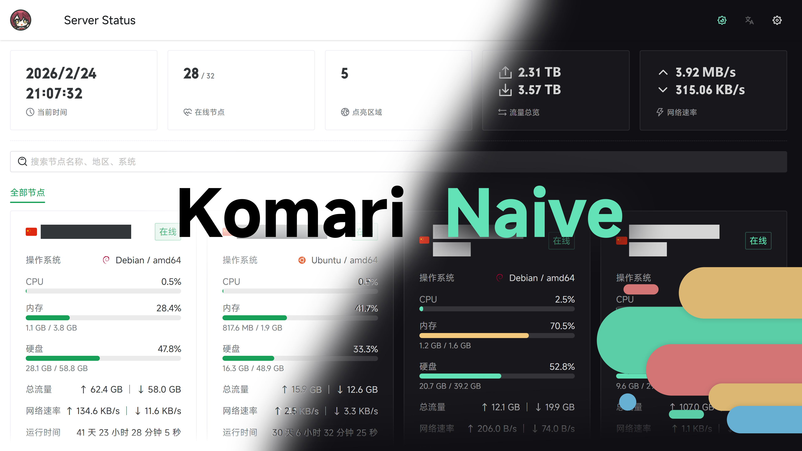

<h3 align="center">Komari Naive</h3>
<p align="center">基于 Vue 3 + Vite + UnoCSS + Naive UI 构建的 Komari Monitor 主题</p>

<p align="center">
  <a href="https://github.com/lyimoexiao/komari-theme-naive/blob/main/LICENSE">
    
  </a>
  <a href="https://github.com/lyimoexiao/komari-theme-naive/releases">
    
  </a>
  <a href="https://github.com/lyimoexiao/komari-theme-naive/stargazers">
    
  </a>
</p>

<a href="https://github.com/lyimoexiao/komari-theme-naive">
  
</a>

---

## 特性

- 🎨 **现代化设计** - 基于 Naive UI 组件库，界面简洁优雅
- 🚀 **高性能** - Vite 7 构建，秒级热更新
- 📱 **响应式布局** - 完美适配桌面端和移动端
- 🌈 **主题定制** - 支持一键切换浅色/深色模式
- 📊 **数据可视化** - 集成 ECharts，图表展示更直观
- 🎯 **类型安全** - 全面使用 TypeScript，开发体验更佳
- 🛠️ **开发友好** - 完善的代码规范和工具链

## 安装使用

### 方式一：从 Release 下载

1. 从 [Release 页面](https://github.com/lyimoexiao/komari-theme-naive/releases) 下载最新的 `komari-theme-naive-build-*.zip` 文件
2. 登录 Komari Monitor 后，点击 `设置` → `主题管理`
3. 点击 `上传主题` 按钮，选择下载的 zip 文件
4. 刷新页面，即可看到新主题生效

### 方式二：自行构建

```bash
# 克隆仓库
git clone https://github.com/lyimoexiao/komari-theme-naive.git
cd komari-theme-naive

# 安装依赖
pnpm i

# 构建
pnpm build

# 构建产物在 dist/ 目录，打包后上传即可
```

## 环境要求

| 工具      | 版本要求              |
| --------- | --------------------- |
| Node.js   | `^20.19.0` 或 `>=22.12.0` |
| pnpm      | `^10.28.2`            |

## 开发指南

```bash
# 安装依赖
pnpm i

# 启动开发服务器（支持热更新）
pnpm dev

# 类型检查
pnpm type-check

# 代码检查
pnpm lint

# 代码格式化
pnpm format
```

## 构建命令

```bash
# 类型检查 + 生产构建
pnpm build

# 预览生产构建
pnpm preview

# 构建并打包（生成可上传的 zip 文件）
pnpm build:zip
```

## 技术栈

| 类别       | 技术                                       |
| ---------- | ------------------------------------------ |
| 框架       | Vue 3 (Composition API + `<script setup>`) |
| 构建工具   | Vite 7                                     |
| UI 组件库  | Naive UI                                   |
| 状态管理   | Pinia 3                                    |
| 路由       | Vue Router 5                               |
| CSS 方案   | UnoCSS (Wind4 preset) + SCSS               |
| 图表库     | ECharts + vue-echarts                      |
| 代码规范   | ESLint (@antfu/eslint-config) + oxlint     |
| 类型系统   | TypeScript 5                               |

## 项目结构

```
komari-theme-naive/
├── src/                  # 源代码目录
│   ├── components/       # 可复用组件
│   ├── views/            # 页面视图
│   ├── styles/           # 样式文件
│   ├── utils/            # 工具函数
│   └── types/            # TypeScript 类型定义
├── public/               # 静态资源
├── docs/                 # 文档和预览图
├── package.json          # 项目配置
└── vite.config.ts        # Vite 配置
```

## 贡献指南

欢迎提交 Issue 和 Pull Request！

1. Fork 本仓库
2. 创建你的特性分支 (`git checkout -b feature/AmazingFeature`)
3. 提交你的改动 (`git commit -m 'Add some AmazingFeature'`)
4. 推送到分支 (`git push origin feature/AmazingFeature`)
5. 开启一个 Pull Request

## 参考项目

- [Komari](https://github.com/komari-monitor/komari) - 原始监控系统
- [Komari Next](https://github.com/tonyliuzj/komari-next) - 参考实现
- [Vue 3](https://vuejs.org/) - 渐进式 JavaScript 框架
- [Vite](https://vitejs.dev/) - 下一代前端构建工具
- [Naive UI](https://www.naiveui.com/) - Vue 3 组件库
- [UnoCSS](https://unocss.dev/) - 即时按需原子 CSS 引擎

## License

[MIT License](./LICENSE)

---

